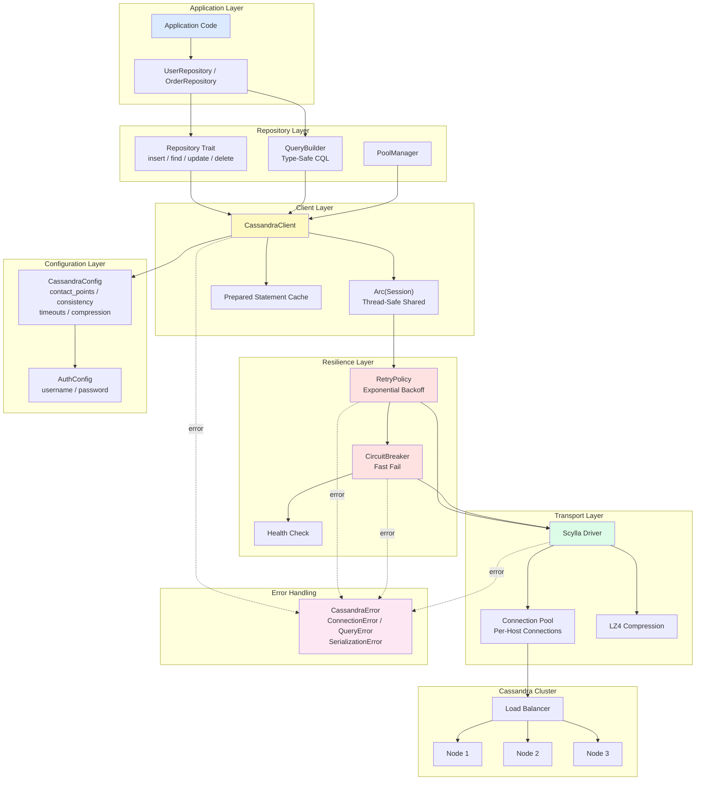
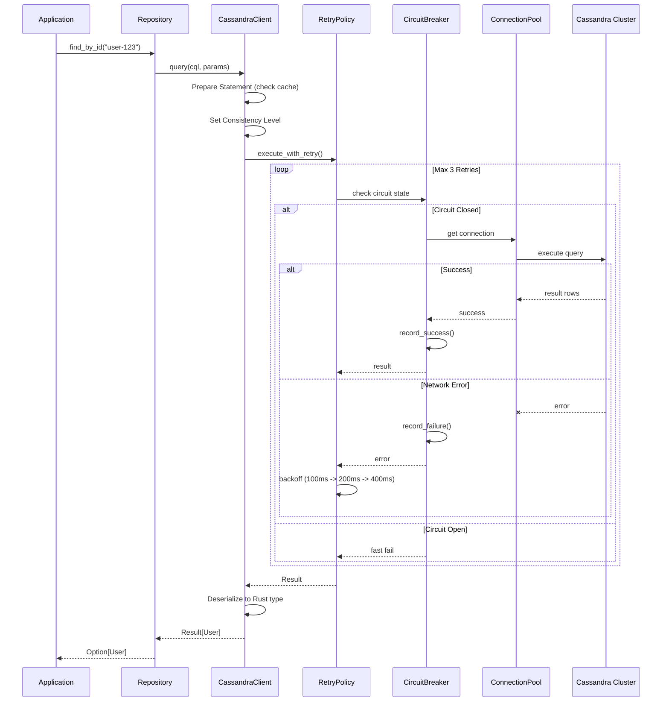

# Cassandra Rust Client

A high-performance, type-safe Cassandra database client library written in Rust.

## Features

- ✅ **Async Support**: Fully asynchronous operations powered by Tokio
- ✅ **Type Safety**: Compile-time safety guaranteed by Rust's strong type system
- ✅ **Connection Pool**: Built-in connection pool management for high concurrency
- ✅ **Retry Mechanism**: Automatic retry with exponential backoff strategy
- ✅ **Circuit Breaker**: Circuit breaker pattern to prevent cascading failures
- ✅ **Query Builder**: Type-safe CQL query construction
- ✅ **Repository Pattern**: Abstracted data access layer
- ✅ **Zero-Copy**: Minimized memory allocation and copying
- ✅ **Compression**: LZ4 compression to reduce network transfer

## Architecture

### System Architecture Diagram



### Query Execution Sequence Diagram



### Core Modules

1. **Client Layer** (`client.rs`)
   - Manages connections to the Cassandra cluster
   - Provides a unified query execution interface
   - Handles session lifecycle and connection pooling

2. **Configuration Layer** (`config.rs`)
   - Flexible configuration management
   - Supports multiple consistency levels
   - Authentication and timeout settings

3. **Repository Layer** (`repository.rs`)
   - Abstracts the data access pattern
   - Provides CRUD operation interfaces
   - Type-safe query builder

4. **Retry & Circuit Breaker** (`retry.rs`)
   - Automatically retries failed operations
   - Circuit breaker prevents system overload
   - Exponential backoff strategy

5. **Error Handling** (`error.rs`)
   - Unified error handling
   - Detailed error classification
   - Error chain tracing

## Quick Start

### Add Dependency

Add to your `Cargo.toml`:

```toml
[dependencies]
cassandra-rust-client = { path = "./cassandra-rust-client" }
tokio = { version = "1.35", features = ["full"] }
```

### Basic Usage

```rust
use cassandra_rust_client::{CassandraClient, CassandraConfig, ConsistencyLevel};

#[tokio::main]
async fn main() -> Result<(), Box<dyn std::error::Error>> {
    // Configure the client
    let config = CassandraConfig {
        contact_points: vec!["127.0.0.1:9042".to_string()],
        keyspace: Some("my_keyspace".to_string()),
        consistency: ConsistencyLevel::Quorum,
        ..Default::default()
    };

    // Create client
    let client = CassandraClient::new(config).await?;

    // Execute query
    client.execute(
        "INSERT INTO users (id, name) VALUES (?, ?)",
        (uuid::Uuid::new_v4(), "John Doe")
    ).await?;

    Ok(())
}
```

### Using the Repository Pattern

```rust
use cassandra_rust_client::{Repository, CassandraClient};
use async_trait::async_trait;

struct User {
    id: Uuid,
    name: String,
    email: String,
}

struct UserRepository {
    client: CassandraClient,
}

#[async_trait]
impl Repository<User> for UserRepository {
    async fn insert(&self, user: &User) -> Result<()> {
        self.client.execute(
            "INSERT INTO users (id, name, email) VALUES (?, ?, ?)",
            (&user.id, &user.name, &user.email)
        ).await
    }

    // ... implement other methods
}
```

## Why Rust?

### 1. Performance
- **Zero-Cost Abstractions**: No runtime overhead from abstraction layers
- **No GC**: No garbage collection pauses — predictable, low latency
- **Memory Efficiency**: Precise memory control with minimal footprint
- **SIMD Support**: Leverage CPU SIMD instructions for acceleration

**Performance Comparison** (relative to other languages):
- **10–100x** faster than Python/Ruby
- **2–5x** faster than Java/C#
- Comparable to C/C++

### 2. Memory Safety
- **Compile-Time Guarantees**: Memory errors caught at compile time
- **No Null Pointers**: `Option<T>` eliminates null pointer exceptions
- **No Data Races**: Ownership system prevents concurrent bugs
- **No Use-After-Free**: Lifetime checks eliminate dangling pointers

```rust
let data = vec![1, 2, 3];
let reference = &data[0];
// drop(data); // Compile error! reference is still in use
println!("{}", reference);
```

### 3. Concurrency Safety
- **Send/Sync Traits**: Thread safety verified at compile time
- **No Data Races**: Type system guarantees concurrent safety
- **Async/Await**: Efficient asynchronous programming model

### 4. Expressiveness
- **Pattern Matching**: Powerful structural pattern matching
- **Algebraic Types**: `Result`/`Option` force explicit error handling
- **Trait System**: Flexible polymorphism and code reuse
- **Macro System**: Compile-time metaprogramming

```rust
// Forced error handling — nothing can be silently ignored
match client.query("SELECT * FROM users").await {
    Ok(users) => process_users(users),
    Err(e) => handle_error(e),
}
```

### 5. Language Comparison

| Feature | Rust | Java | Python | Go |
|---------|------|------|--------|-----|
| Performance | ⭐⭐⭐⭐⭐ | ⭐⭐⭐ | ⭐ | ⭐⭐⭐⭐ |
| Memory Safety | ⭐⭐⭐⭐⭐ | ⭐⭐⭐⭐ | ⭐⭐⭐⭐ | ⭐⭐⭐ |
| Concurrency | ⭐⭐⭐⭐⭐ | ⭐⭐⭐ | ⭐⭐ | ⭐⭐⭐⭐⭐ |
| Learning Curve | ⭐⭐ | ⭐⭐⭐ | ⭐⭐⭐⭐⭐ | ⭐⭐⭐⭐ |
| Ecosystem | ⭐⭐⭐⭐ | ⭐⭐⭐⭐⭐ | ⭐⭐⭐⭐⭐ | ⭐⭐⭐⭐ |
| Compile-Time Checks | ⭐⭐⭐⭐⭐ | ⭐⭐⭐ | ⭐ | ⭐⭐⭐ |

## Running Examples

```bash
# Start Cassandra
docker run -d -p 9042:9042 cassandra:latest

# Run example
cargo run --example basic_usage
```

## Testing

```bash
cargo test
```

## Benchmarks

```bash
cargo bench
```

## License

MIT License

## Contributing

Issues and Pull Requests are welcome!
