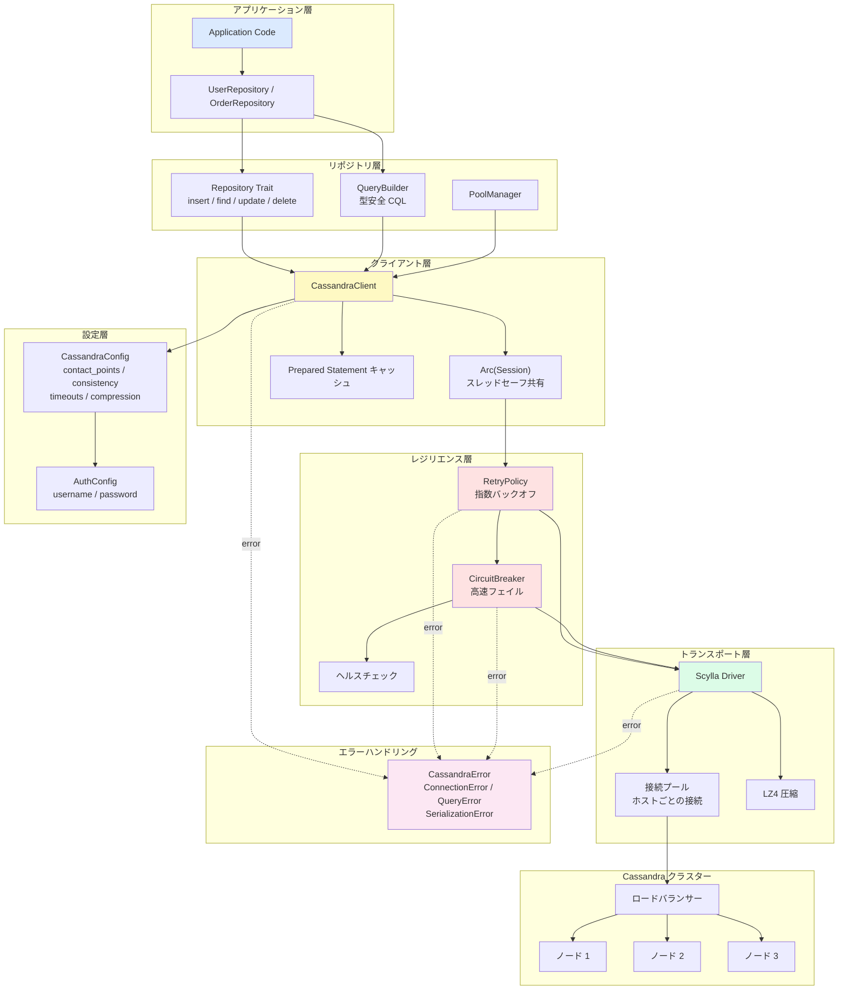
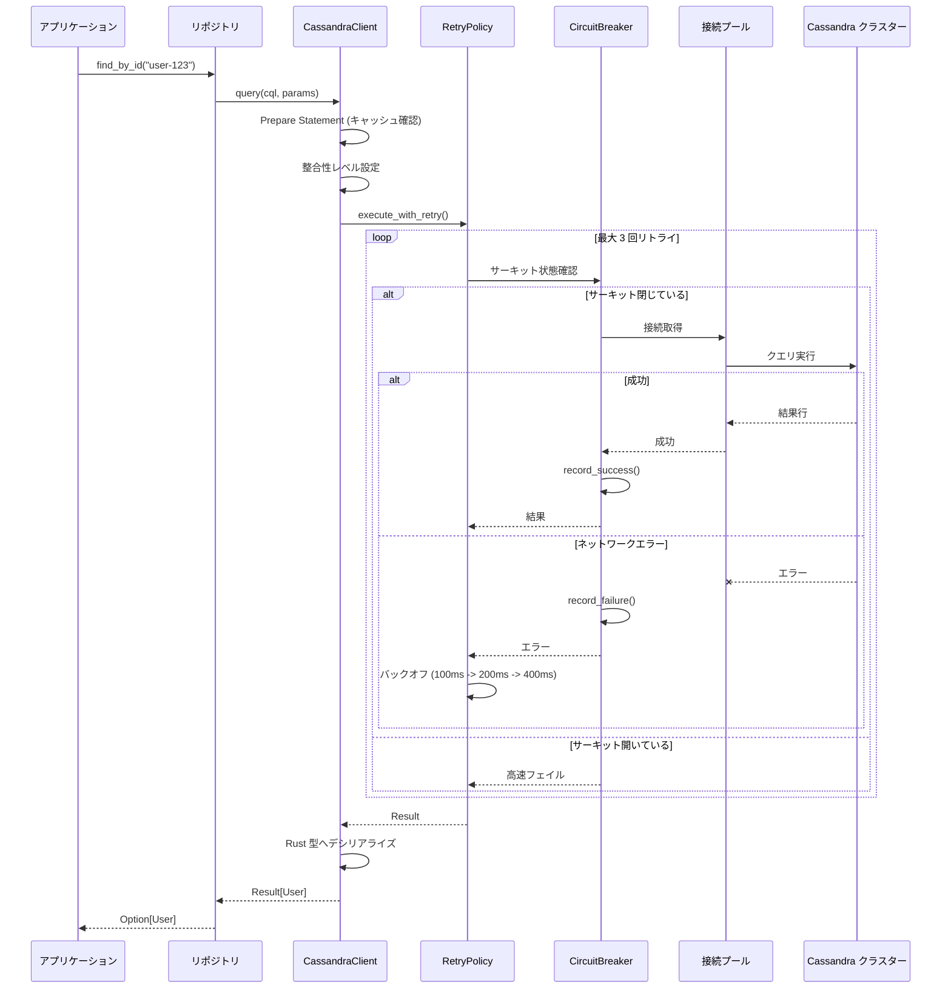

# Cassandra Rust クライアント

Rust で書かれた高パフォーマンス・型安全な Cassandra データベースクライアントライブラリ。

## 特徴

- ✅ **非同期サポート**: Tokio による完全非同期操作
- ✅ **型安全性**: Rust の強力な型システムによるコンパイル時安全保証
- ✅ **接続プール**: 高並行性対応の組み込み接続プール管理
- ✅ **リトライ機構**: 指数バックオフ戦略による自動リトライ
- ✅ **サーキットブレーカー**: カスケード障害を防ぐサーキットブレーカーパターン
- ✅ **クエリビルダー**: 型安全な CQL クエリ構築
- ✅ **リポジトリパターン**: 抽象化されたデータアクセスレイヤー
- ✅ **ゼロコピー**: メモリ割り当てとコピーを最小化
- ✅ **圧縮サポート**: LZ4 圧縮によるネットワーク転送量の削減

## アーキテクチャ

### システムアーキテクチャ図



### クエリ実行シーケンス図



### コアモジュール

1. **クライアント層** (`client.rs`)
   - Cassandra クラスターへの接続管理
   - 統一されたクエリ実行インターフェース
   - セッションライフサイクルと接続プール管理

2. **設定層** (`config.rs`)
   - 柔軟な設定管理
   - 複数の整合性レベルのサポート
   - 認証とタイムアウト設定

3. **リポジトリ層** (`repository.rs`)
   - データアクセスパターンの抽象化
   - CRUD 操作インターフェースの提供
   - 型安全なクエリビルダー

4. **リトライ & サーキットブレーカー** (`retry.rs`)
   - 失敗した操作の自動リトライ
   - サーキットブレーカーによるシステム過負荷防止
   - 指数バックオフ戦略

5. **エラーハンドリング** (`error.rs`)
   - 統一されたエラー処理
   - 詳細なエラー分類
   - エラーチェーンのトレース

## クイックスタート

### 依存関係の追加

`Cargo.toml` に追加:

```toml
[dependencies]
cassandra-rust-client = { path = "./cassandra-rust-client" }
tokio = { version = "1.35", features = ["full"] }
```

### 基本的な使い方

```rust
use cassandra_rust_client::{CassandraClient, CassandraConfig, ConsistencyLevel};

#[tokio::main]
async fn main() -> Result<(), Box<dyn std::error::Error>> {
    // クライアントの設定
    let config = CassandraConfig {
        contact_points: vec!["127.0.0.1:9042".to_string()],
        keyspace: Some("my_keyspace".to_string()),
        consistency: ConsistencyLevel::Quorum,
        ..Default::default()
    };

    // クライアントの作成
    let client = CassandraClient::new(config).await?;

    // クエリの実行
    client.execute(
        "INSERT INTO users (id, name) VALUES (?, ?)",
        (uuid::Uuid::new_v4(), "John Doe")
    ).await?;

    Ok(())
}
```

### リポジトリパターンの使用

```rust
use cassandra_rust_client::{Repository, CassandraClient};
use async_trait::async_trait;

struct User {
    id: Uuid,
    name: String,
    email: String,
}

struct UserRepository {
    client: CassandraClient,
}

#[async_trait]
impl Repository<User> for UserRepository {
    async fn insert(&self, user: &User) -> Result<()> {
        self.client.execute(
            "INSERT INTO users (id, name, email) VALUES (?, ?, ?)",
            (&user.id, &user.name, &user.email)
        ).await
    }

    // ... 他のメソッドを実装
}
```

## なぜ Rust なのか？

### 1. パフォーマンス
- **ゼロコスト抽象化**: 抽象化レイヤーによる実行時オーバーヘッドなし
- **GC なし**: ガベージコレクションの停止なし — 予測可能な低レイテンシ
- **メモリ効率**: 精密なメモリ制御で最小限のフットプリント
- **SIMD サポート**: CPU の SIMD 命令を活用した高速化

**パフォーマンス比較** (他言語との比較):
- Python/Ruby より **10〜100 倍** 高速
- Java/C# より **2〜5 倍** 高速
- C/C++ と同等の性能

### 2. メモリ安全性
- **コンパイル時保証**: メモリエラーをコンパイル時に検出
- **ヌルポインタなし**: `Option<T>` でヌルポインタ例外を排除
- **データ競合なし**: 所有権システムで並行バグを防止
- **Use-After-Free なし**: ライフタイムチェックでダングリングポインタを排除

```rust
let data = vec![1, 2, 3];
let reference = &data[0];
// drop(data); // コンパイルエラー！reference はまだ使用中
println!("{}", reference);
```

### 3. 並行安全性
- **Send/Sync トレイト**: スレッド安全性をコンパイル時に検証
- **データ競合なし**: 型システムが並行安全性を保証
- **Async/Await**: 効率的な非同期プログラミングモデル

### 4. 表現力
- **パターンマッチング**: 強力な構造的パターンマッチング
- **代数的データ型**: `Result`/`Option` で明示的なエラー処理を強制
- **トレイトシステム**: 柔軟な多態性とコード再利用
- **マクロシステム**: コンパイル時メタプログラミング

```rust
// エラー処理の強制 — 暗黙的な無視は不可能
match client.query("SELECT * FROM users").await {
    Ok(users) => process_users(users),
    Err(e) => handle_error(e),
}
```

### 5. 言語比較

| 特徴 | Rust | Java | Python | Go |
|------|------|------|--------|-----|
| パフォーマンス | ⭐⭐⭐⭐⭐ | ⭐⭐⭐ | ⭐ | ⭐⭐⭐⭐ |
| メモリ安全性 | ⭐⭐⭐⭐⭐ | ⭐⭐⭐⭐ | ⭐⭐⭐⭐ | ⭐⭐⭐ |
| 並行性 | ⭐⭐⭐⭐⭐ | ⭐⭐⭐ | ⭐⭐ | ⭐⭐⭐⭐⭐ |
| 学習曲線 | ⭐⭐ | ⭐⭐⭐ | ⭐⭐⭐⭐⭐ | ⭐⭐⭐⭐ |
| エコシステム | ⭐⭐⭐⭐ | ⭐⭐⭐⭐⭐ | ⭐⭐⭐⭐⭐ | ⭐⭐⭐⭐ |
| コンパイル時チェック | ⭐⭐⭐⭐⭐ | ⭐⭐⭐ | ⭐ | ⭐⭐⭐ |

## サンプルの実行

```bash
# Cassandra を起動
docker run -d -p 9042:9042 cassandra:latest

# サンプルを実行
cargo run --example basic_usage
```

## テスト

```bash
cargo test
```

## ベンチマーク

```bash
cargo bench
```

## ライセンス

MIT License

## コントリビューション

Issue や Pull Request を歓迎します！
