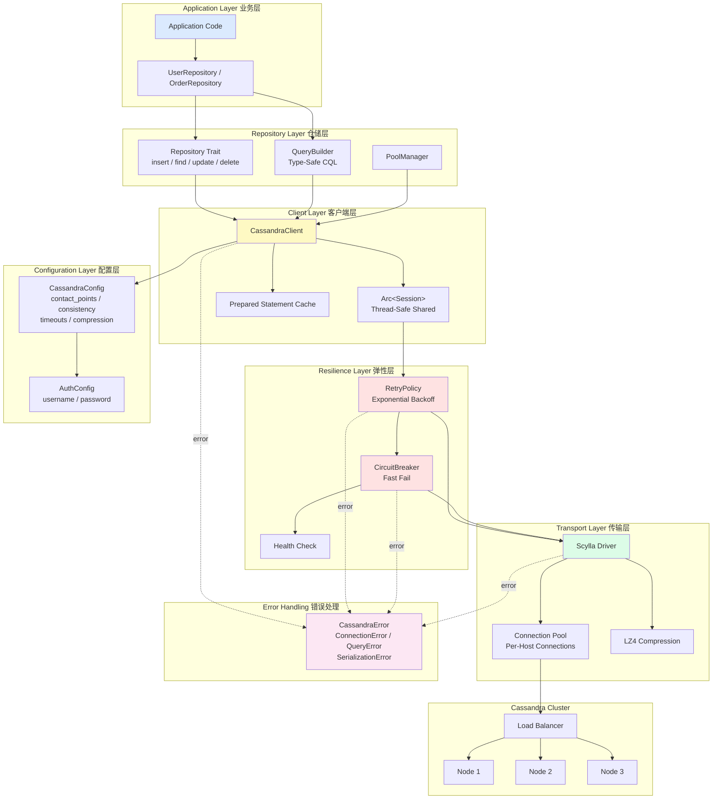

# Cassandra Rust Client

一个高性能、类型安全的 Rust Cassandra 数据库客户端库。

## 特性

- ✅ **异步支持**: 基于 Tokio 的完全异步操作
- ✅ **类型安全**: 利用 Rust 的强类型系统确保编译时安全
- ✅ **连接池**: 内置连接池管理，支持高并发
- ✅ **重试机制**: 自动重试和指数退避策略
- ✅ **熔断器**: 防止级联故障的熔断器模式
- ✅ **查询构建器**: 类型安全的 CQL 查询构建
- ✅ **Repository 模式**: 抽象数据访问层
- ✅ **零拷贝**: 最小化内存分配和拷贝
- ✅ **压缩支持**: LZ4 压缩减少网络传输

## 架构设计

### 系统架构流程图



### 查询执行时序图

```mermaid
sequenceDiagram
    participant App as Application
    participant Repo as Repository
    participant Client as CassandraClient
    participant Retry as RetryPolicy
    participant CB as CircuitBreaker
    participant Pool as ConnectionPool
    participant DB as Cassandra Cluster

    App->>Repo: find_by_id("user-123")
    Repo->>Client: query(cql, params)
    Client->>Client: Prepare Statement (check cache)
    Client->>Client: Set Consistency Level

    Client->>Retry: execute_with_retry()

    loop Max 3 Retries
        Retry->>CB: check circuit state
        alt Circuit Closed
            CB->>Pool: get connection
            Pool->>DB: execute query
            alt Success
                DB-->>Pool: result rows
                Pool-->>CB: success
                CB->>CB: record_success()
                CB-->>Retry: result
            else Network Error
                DB--xPool: error
                CB->>CB: record_failure()
                CB-->>Retry: error
                Retry->>Retry: backoff (100ms -> 200ms -> 400ms)
            end
        else Circuit Open
            CB-->>Retry: fast fail
        end
    end

    Retry-->>Client: Result
    Client->>Client: Deserialize to Rust type
    Client-->>Repo: Result&lt;User&gt;
    Repo-->>App: Option&lt;User&gt;
```

### 核心模块

1. **Client 层** (`client.rs`)
   - 管理与 Cassandra 集群的连接
   - 提供基础的查询执行接口
   - 支持连接池和会话管理

2. **Configuration 层** (`config.rs`)
   - 灵活的配置管理
   - 支持多种一致性级别
   - 认证和超时配置

3. **Repository 层** (`repository.rs`)
   - 抽象数据访问模式
   - 提供 CRUD 操作接口
   - 查询构建器

4. **Retry & Circuit Breaker** (`retry.rs`)
   - 自动重试失败的操作
   - 熔断器防止系统过载
   - 指数退避策略

5. **Error Handling** (`error.rs`)
   - 统一的错误处理
   - 详细的错误分类
   - 错误链追踪

## 快速开始

### 安装依赖

在 `Cargo.toml` 中添加：

```toml
[dependencies]
cassandra-rust-client = { path = "./cassandra-rust-client" }
tokio = { version = "1.35", features = ["full"] }
```

### 基本使用

```rust
use cassandra_rust_client::{CassandraClient, CassandraConfig, ConsistencyLevel};

#[tokio::main]
async fn main() -> Result<(), Box<dyn std::error::Error>> {
    // 配置客户端
    let config = CassandraConfig {
        contact_points: vec!["127.0.0.1:9042".to_string()],
        keyspace: Some("my_keyspace".to_string()),
        consistency: ConsistencyLevel::Quorum,
        ..Default::default()
    };
    
    // 创建客户端
    let client = CassandraClient::new(config).await?;
    
    // 执行查询
    client.execute(
        "INSERT INTO users (id, name) VALUES (?, ?)",
        (uuid::Uuid::new_v4(), "John Doe")
    ).await?;
    
    Ok(())
}
```

### 使用 Repository 模式

```rust
use cassandra_rust_client::{Repository, CassandraClient};
use async_trait::async_trait;

struct User {
    id: Uuid,
    name: String,
    email: String,
}

struct UserRepository {
    client: CassandraClient,
}

#[async_trait]
impl Repository<User> for UserRepository {
    async fn insert(&self, user: &User) -> Result<()> {
        self.client.execute(
            "INSERT INTO users (id, name, email) VALUES (?, ?, ?)",
            (&user.id, &user.name, &user.email)
        ).await
    }
    
    // ... 实现其他方法
}
```

## Rust 相对于其他语言的优势

### 1. **性能优势**
- **零成本抽象**: Rust 的抽象不会带来运行时开销
- **无 GC**: 没有垃圾回收导致的暂停，延迟更可预测
- **内存效率**: 精确的内存控制，减少内存占用
- **SIMD 支持**: 可以利用 CPU 的 SIMD 指令加速

**性能对比** (相对于其他语言):
- 比 Python/Ruby 快 **10-100x**
- 比 Java/C# 快 **2-5x**
- 与 C/C++ 性能相当

### 2. **内存安全**
- **编译时保证**: 在编译期检测内存错误
- **无空指针**: Option 类型避免空指针异常
- **无数据竞争**: 所有权系统防止并发 bug
- **无 Use-After-Free**: 生命周期检查避免悬垂指针

```rust
// Rust 编译期防止这类错误
let data = vec![1, 2, 3];
let reference = &data[0];
// drop(data); // 编译错误！reference 还在使用
println!("{}", reference);
```

### 3. **并发安全**
- **Send/Sync Trait**: 编译时验证线程安全
- **无数据竞争**: 类型系统保证并发安全
- **Async/Await**: 高效的异步编程模型

```rust
// 这段代码在 Rust 中无法编译，但在 Go/Java 中会导致数据竞争
let mut counter = 0;
tokio::spawn(async move {
    counter += 1; // 编译错误：不能在多个线程间共享可变引用
});
```

### 4. **表达能力**
- **模式匹配**: 强大的模式匹配能力
- **代数数据类型**: Result/Option 强制错误处理
- **Trait 系统**: 灵活的多态和代码复用
- **宏系统**: 编译时元编程

```rust
// 强制错误处理，避免遗漏
match client.query("SELECT * FROM users").await {
    Ok(users) => process_users(users),
    Err(e) => handle_error(e), // 必须处理错误
}
```

### 5. **生态系统优势**
- **Cargo**: 优秀的包管理和构建工具
- **文档生成**: 自动从代码生成文档
- **测试集成**: 内置测试框架
- **跨平台**: 轻松编译到多个平台

### 6. **对比其他语言**

| 特性 | Rust | Java | Python | Go |
|------|------|------|--------|-----|
| 性能 | ⭐⭐⭐⭐⭐ | ⭐⭐⭐ | ⭐ | ⭐⭐⭐⭐ |
| 内存安全 | ⭐⭐⭐⭐⭐ | ⭐⭐⭐⭐ | ⭐⭐⭐⭐ | ⭐⭐⭐ |
| 并发性 | ⭐⭐⭐⭐⭐ | ⭐⭐⭐ | ⭐⭐ | ⭐⭐⭐⭐⭐ |
| 学习曲线 | ⭐⭐ | ⭐⭐⭐ | ⭐⭐⭐⭐⭐ | ⭐⭐⭐⭐ |
| 生态系统 | ⭐⭐⭐⭐ | ⭐⭐⭐⭐⭐ | ⭐⭐⭐⭐⭐ | ⭐⭐⭐⭐ |
| 编译时检查 | ⭐⭐⭐⭐⭐ | ⭐⭐⭐ | ⭐ | ⭐⭐⭐ |

## 运行示例

```bash
# 确保 Cassandra 正在运行
docker run -d -p 9042:9042 cassandra:latest

# 运行示例
cargo run --example basic_usage
```

## 测试

```bash
cargo test
```

## 基准测试

```bash
cargo bench
```

## 许可证

MIT License

## 贡献

欢迎提交 Issue 和 Pull Request！
